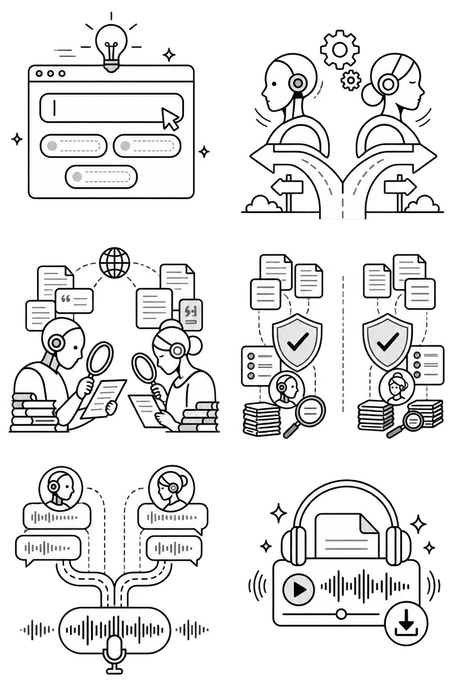

<p align="center">
  
</p>

<h1 align="center">Yappa.ai</h1>

<p align="center">
  Yappa.ai turns a question and a time limit into a source-backed, two-sided podcast so learners can examine the trade-offs instead of settling for one summary.
</p>

<p align="center">
  <a href="apps/web/public/demos/ai-agents-tools.mp3"><strong>Listen to a 1-minute debate</strong></a>
</p>

<!-- README-HACK:NEEDS-OWNER key="demo-video" instruction="Replace this marker with the final public hackathon demo video URL." -->
<!-- README-HACK:NEEDS-OWNER key="live-demo" instruction="Replace this marker with the verified public Yappa.ai deployment URL." -->

## Why Yappa

Learning from one explanation is fast, but it can hide assumptions and make a confident answer feel complete. A good debate makes the disagreement visible. It forces claims to meet counterarguments, shows where evidence is strong or uncertain, and gives the learner room to decide.

Yappa brings that experience to the time people already have. Choose a question and a 1, 3, or 5-minute episode length, then listen while commuting, exercising, or working.

## What Yappa does

- **Builds both cases independently.** Two research agents use web search to make the strongest defensible case for and against the proposition.
- **Checks claims before writing.** Separate verifier agents audit sources, correct overstatements, and reject unsupported material.
- **Edits to a measurable quality bar.** Yappa reviews and revises the debate for factual accuracy, natural dialogue, text-to-speech readiness, and the requested duration.
- **Turns the result into audio.** Fish Audio voices the two speakers as a playable MP3, while Yappa retains the transcript and source list.
- **Keeps learning after the episode.** A verified debate can become a reading article, and learners can select a passage and ask a follow-up grounded in the episode's transcript and sources.

<p align="center">
  
</p>

## Evidence is part of the product

Yappa does not ask one model to improvise both sides and call the result balanced. Research and verification are separate stages. Each side gathers its own evidence, an independent verifier checks the claims, and only approved material reaches the debate editor. The final quality gate must pass before audio synthesis begins.

<p align="center">
  
</p>

What works today includes Google sign-in, saved interests and topic suggestions, scheduled generation, voice and content preferences, retryable jobs, public podcast pages, audio playback, full transcripts, source links, learning articles, and passage-based follow-up questions.

## How it is built

The Next.js app handles the public experience, authenticated workspace, podcast library, and learning views. It calls a Hono API that owns Google OAuth, generation jobs, access control, and the debate pipeline. The API coordinates OpenAI research and editing calls, sends the approved script to Fish Audio, and stores users, interests, episode state, transcripts, sources, articles, and usage data in SQLite through Drizzle ORM. Generated research artifacts and audio remain in the local `data/` directory.

<!-- README-HACK:GRAPH
type: architecture
brief: Show the learner using the Next.js web app, the app calling the Hono API, Google OAuth protecting creation and settings, the API coordinating two OpenAI research agents plus two verifier agents and a transcript editor, Fish Audio producing the MP3, and SQLite plus local artifact storage retaining episode data. Distinguish public podcast reading from authenticated creation and management.
placement: after "How it is built"
-->

## Built with

- Bun workspaces, TypeScript, Next.js, React, and Tailwind CSS
- Hono and Zod for the API and request validation
- OpenAI structured outputs for research, verification, writing, and article Q&A, with web search enabled for evidence gathering and claim checks
- Fish Audio for two-speaker text-to-speech
- SQLite and Drizzle ORM for local persistence and migrations
- Google OAuth for account access

## Run locally

Yappa uses Bun 1.3.14. Copy the environment template, add valid OpenAI, Fish Audio, and Google OAuth credentials, then start both applications:

```bash
bun install
cp .env.example .env
bun run dev
```

The development command applies pending database migrations before starting the web app at `http://localhost:3000` and the API at `http://localhost:3101`. The API health check is available at `http://localhost:3101/health`.

Run the repository checks with:

```bash
bun test
bun run check
bun run lint
bun run build
```

## What's next

- Publish the live demo and final hackathon video.
- Move SQLite and generated audio to hosted persistence for a durable multi-instance deployment.
- Add more episode-length choices after generation time and cost are measured in production.
