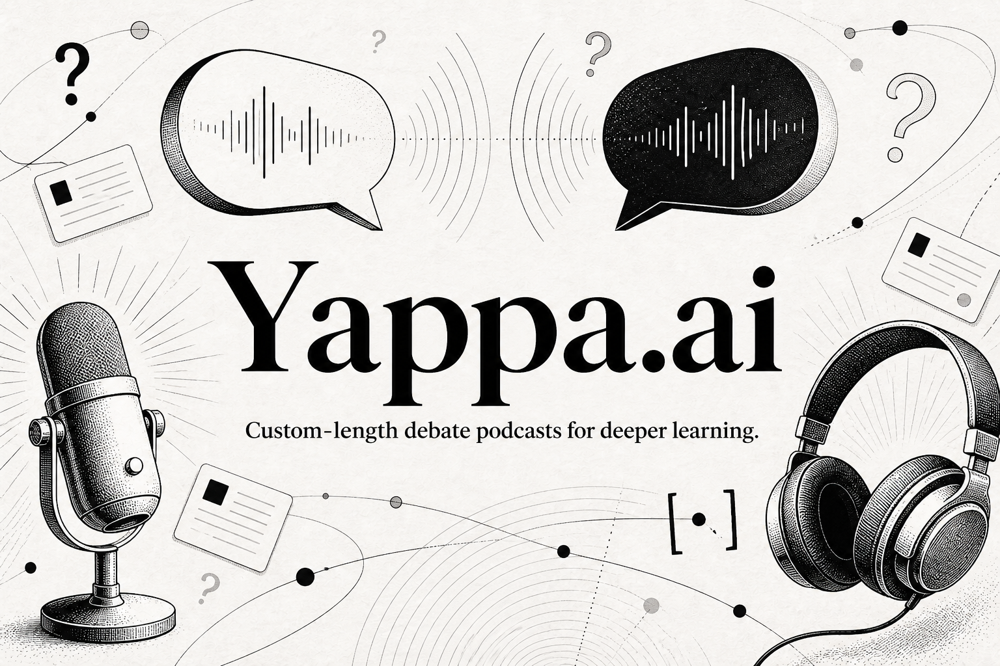

<p align="center">
  
</p>

<h1 align="center">Yappa.ai</h1>

<p align="center">
  Yappa.ai turns a question and a time limit into a source-backed, two-sided podcast so learners can examine the trade-offs instead of settling for one summary.
</p>

<p align="center">
  <a href="apps/web/public/demos/ai-agents-tools.mp3"><strong>Listen to a 1-minute debate</strong></a>
</p>

<!-- README-HACK:NEEDS-OWNER key="demo-video" instruction="Replace this marker with the final public hackathon demo video URL." -->
<!-- README-HACK:NEEDS-OWNER key="live-demo" instruction="Replace this marker with the verified public Yappa.ai deployment URL." -->

## Why Yappa

Most educational content is one-directional: a learner receives an explanation, remembers the conclusion, and rarely sees which assumptions produced it. That works for simple facts. It is much weaker for questions where evidence conflicts, values compete, or every answer carries a trade-off.

A debate makes the structure of a difficult question visible. One side must make a clear case, the other must test it, and both have to respond to the strongest version of the opposing argument. The learner is no longer asked to accept a polished answer. They can compare evidence, notice concessions, identify the real point of disagreement, and form a view of their own.

Yappa turns that learning pattern into something people can use during the time they already have. Instead of opening ten tabs or listening to a generic hour-long show, a learner chooses the exact question and a 1, 3, or 5-minute episode length. The result is a focused conversation designed for a commute, a workout, or a short break.

## What Yappa does

Yappa handles the full path from a rough question to a finished learning experience:

1. **Start with a real question.** Enter a debatable topic, choose the episode length, or save interests and let Yappa suggest questions worth exploring. Episodes can begin immediately or be scheduled for later.
2. **Research both positions separately.** Two agents use web search to build the strongest defensible cases for and against the proposition. Each side gathers claims, context, concessions, and direct source URLs.
3. **Verify before writing.** Independent verifier agents audit the research, correct overstated claims, and reject material that cannot be supported. If either side cannot clear verification, Yappa stops instead of producing a confident but unreliable episode.
4. **Write an actual exchange.** An editor turns only the approved claims into a conversation where Maya and Rowan challenge assumptions, answer each other directly, concede strong points, and surface the real disagreement. The transcript is reviewed and revised against factual, conversational, duration, and text-to-speech quality gates.
5. **Create the listening experience.** Fish Audio voices the two speakers, and Yappa publishes the episode with its player, full transcript, sources, and quality score. Failed generation jobs can be retried without restarting the research from scratch.
6. **Continue beyond the podcast.** A finished debate can become a source-linked learning article. Select any passage and ask a follow-up to receive the strongest answer from both sides, grounded in the verified transcript and source catalog.

Listeners can also choose voices and save instructions about what future episodes should include or avoid. Those preferences shape coverage and tone without being treated as evidence.

<!-- README-HACK:GRAPH
type: product-flow
brief: Show a learner entering a question and duration, two agents researching opposing positions, two independent verifiers checking claims, an editor producing and reviewing the debate, Fish Audio voicing it, and the learner receiving audio, transcript, sources, article, and two-sided follow-up answers. Make the verification gate before writing explicit.
placement: after "What Yappa does"
-->

## Evidence is part of the product

Yappa does not ask one model to improvise both sides and call the result balanced. Research, verification, transcript editing, and quality review are separate stages with structured outputs. Transcript turns retain the verified claim IDs behind their factual points, and the final episode keeps a deduplicated source list.

The pipeline also fails visibly. If a verifier cannot approve enough source-backed claims, the transcript misses its requested length, or the final quality thresholds are not met, audio synthesis does not begin. That boundary matters for an educational product: fluent output is not treated as proof that the material is ready to teach from.

## How it is built

The Next.js app handles the public experience, authenticated workspace, podcast library, and learning views. It calls a Hono API that owns Google OAuth, generation jobs, access control, and the debate pipeline. The API coordinates OpenAI research and editing calls, sends the approved script to Fish Audio, and stores users, interests, episode state, transcripts, sources, articles, and usage data in SQLite through Drizzle ORM. Generated research artifacts and audio remain in the local `data/` directory.

<!-- README-HACK:GRAPH
type: architecture
brief: Show the learner using the Next.js web app, the app calling the Hono API, Google OAuth protecting creation and settings, the API coordinating two OpenAI research agents plus two verifier agents and a transcript editor, Fish Audio producing the MP3, and SQLite plus local artifact storage retaining episode data. Distinguish public podcast reading from authenticated creation and management.
placement: after "How it is built"
-->

## Built with

- Bun workspaces, TypeScript, Next.js, React, and Tailwind CSS
- Hono and Zod for the API and request validation
- OpenAI structured outputs for research, verification, writing, and article Q&A, with web search enabled for evidence gathering and claim checks
- Fish Audio for two-speaker text-to-speech
- SQLite and Drizzle ORM for local persistence and migrations
- Google OAuth for account access

## Run locally

Yappa uses Bun 1.3.14. Copy the environment template, add valid OpenAI, Fish Audio, and Google OAuth credentials, then start both applications:

```bash
bun install
cp .env.example .env
bun run dev
```

The development command applies pending database migrations before starting the web app at `http://localhost:3000` and the API at `http://localhost:3101`. The API health check is available at `http://localhost:3101/health`.

Run the repository checks with:

```bash
bun test
bun run check
bun run lint
bun run build
```
